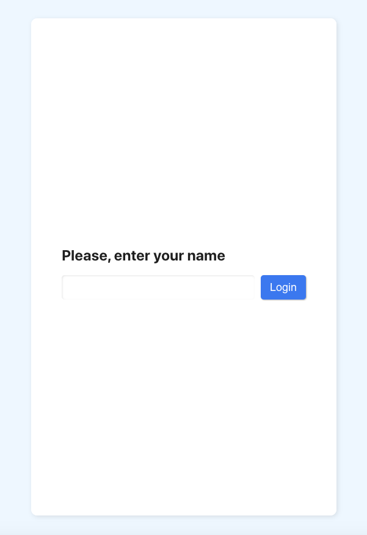
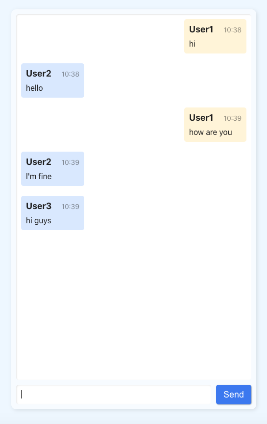
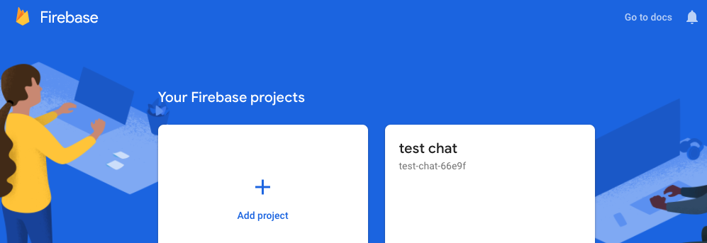
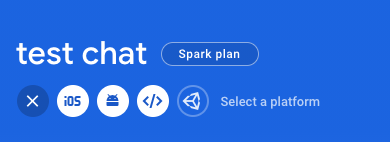
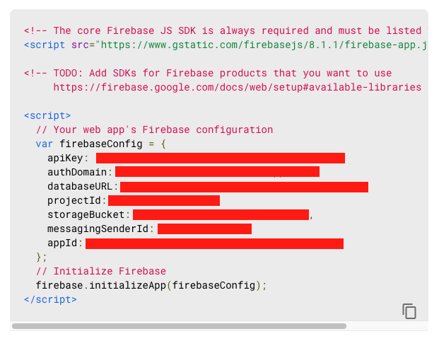

# Simple chat application

The project is simple chat app. Built on [React.js](https://reactjs.org/) and [Firebase Realtime Database](https://firebase.google.com/products/realtime-database).

## Usage

1. The first time you start, you must enter a name. It is stored in local storage

2. You can enter messages in the field at the bottom of the window. Foreign messages are shown in blue. Your messages are shown in yellow.

## Setup

1. Sign in to Firebase console
2. Create new project

3. Add web app for your project. Click on `</>` icon

4. Copy and store the configuration details

5. Clone repository
6. Run `npm install`
7. Copy file `.env.example` and rename it to `.env`. Fill up the file with your Firebase configuration details.
8. Run `npm start` for development
9. Run `npm build` for production build 

This project was bootstrapped with [Create React App](https://github.com/facebook/create-react-app).

